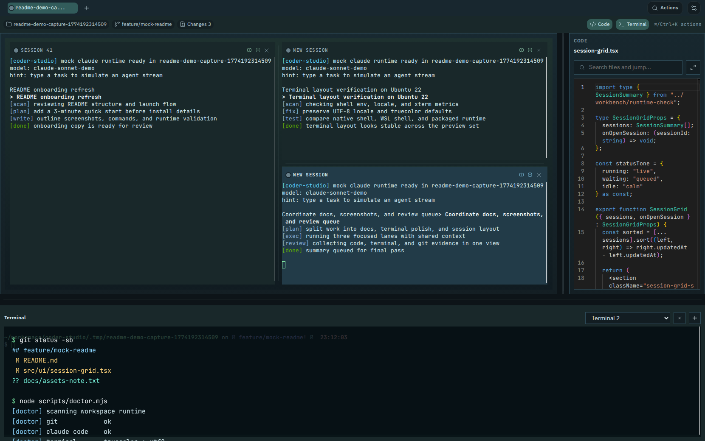
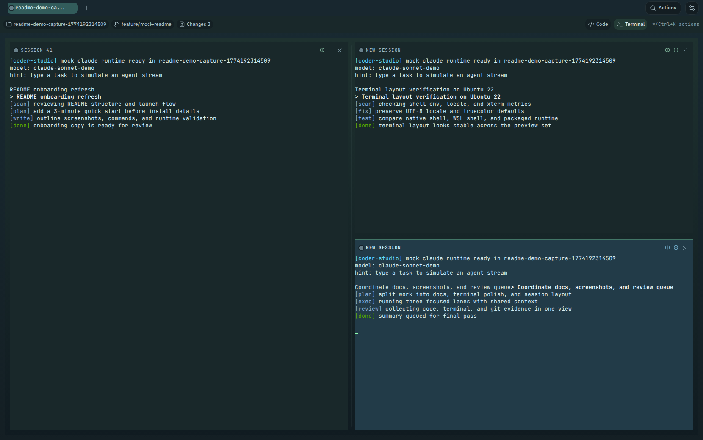
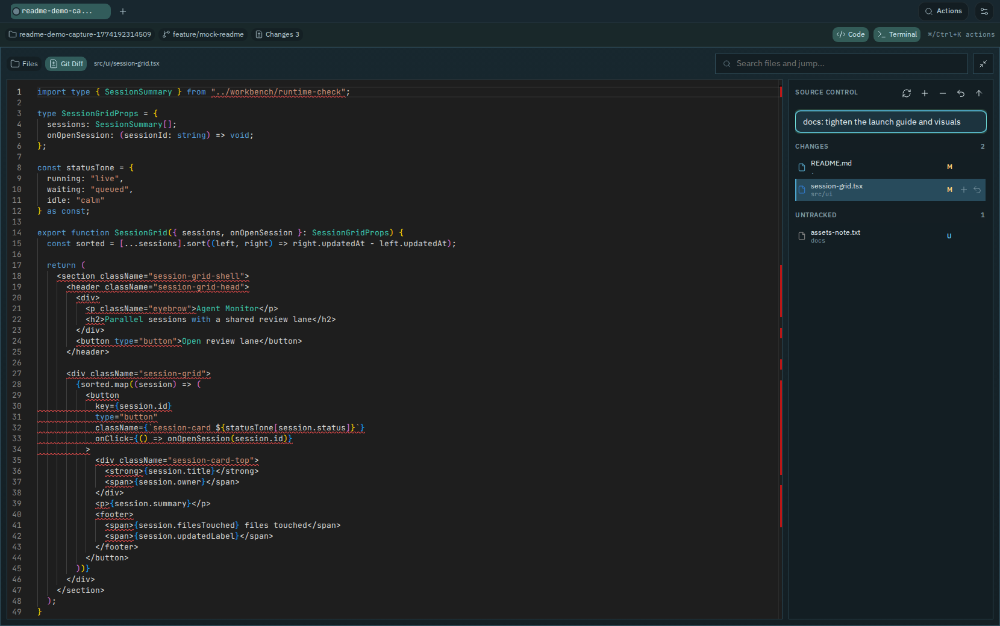

# Coder Studio

[English](README.en.md) | [中文](README.md)

Coder Studio 是一个以 `Claude` 工作流为中心的本地优先 AI 编程工作台，把 `Claude`、仓库、代码编辑、Git 审阅、终端和会话历史放在同一个界面里。它不是一个通用聊天产品，而是一个围绕真实代码仓库和 `Claude Code` 使用场景设计的开发工作台。

你可以把它理解成一个更贴近实际开发流程的工作区：

- 连接本地目录或远程 Git 仓库
- 在一个 workspace 里并行运行多个 Claude session
- 一边看代码、一边改文件、一边做 Git 提交
- 归档和恢复历史 session，继续之前的工作上下文
- 在 `Native` 或 `WSL` 目标环境里运行

## 社区支持

感谢 LinuxDo 各位佬的支持。欢迎加入 [LinuxDo](https://linux.do/)，这里有技术交流、AI 前沿资讯和实战经验分享。

## 适合谁

如果你符合下面这些场景，Coder Studio 会比较合适：

- 你已经在真实仓库里使用 `Claude Code`
- 你希望把 Agent、代码、Git 和终端放进一个界面
- 你经常把一个任务拆成多个并行 session 推进
- 你需要本地优先、可自托管、可控的开发工作台

## Claude 相关能力

这是当前 README 最想强调的部分。

### 1. 把 Claude session 当成真正的工作单元

- 一个 workspace 里可以并行拆分多个 Claude session
- 每个 session 都有自己的上下文和终端交互过程
- 适合把实现、验证、补充说明、代码审阅拆开跑

### 2. 归档、恢复和继续之前的 Claude 会话

- 关闭 session / workspace 时会进入归档历史，而不是直接消失
- 历史记录按 workspace 分组展示，方便回看同一仓库下的上下文
- 你可以恢复归档 session，继续之前的工作
- 也可以永久删除某条历史记录，不再保留任何会话痕迹

### 3. 集中管理 Claude 启动方式

- 在设置页统一管理 Claude 启动参数，而不是手写一整串启动命令
- 支持常用 CLI flags
- 支持完整启动命令预览，方便确认最终会怎么启动
- 可以为 `Native` 和 `WSL` 分别维护不同的 Claude 配置

### 4. 直接编辑 Claude 常用配置项

- 支持常见 `settings.json` 配置项
- 支持常见 `config.json` 配置项
- 支持 API Key、Auth Token、Base URL、额外环境变量等鉴权与网关配置
- 如果你本机已有 Claude 配置文件，设置页会尽量把常见值带出来

### 5. 把 Claude、代码和 Git 放在同一个操作闭环里

- 看 Claude 输出时，可以立刻切到文件和 diff
- 改完代码后，可以直接做 Git 提交
- 不需要在聊天窗口、编辑器、终端和 Git 工具之间反复切换

## 你可以用它做什么

### 1. 用 workspace 管理真实仓库

- 支持 `Local Folder` 和 `Remote Git`
- 支持 `Native` 和 `WSL` 两类执行目标
- 一个工作区就是一套独立的代码、会话和终端上下文

### 2. 在同一个界面里看代码和改代码

- 文件树浏览
- 文件搜索
- Monaco 代码预览和编辑
- 保存当前文件

### 3. 直接做 Git 审阅和提交

- 查看改动
- `Stage / Unstage / Discard`
- 填写提交信息并提交

### 4. 把终端也留在工作流里

- 支持多终端
- 可以随时检查 `git status`、跑脚本、看命令输出
- 不需要在外部终端和工作台之间来回切换

### 5. 以公网模式提供给受控用户访问

- 单口令登录
- `HttpOnly` session cookie
- IP 级错误次数封禁
- `root.path` 单根目录白名单

## 界面预览

下面的截图使用的是 demo 工作区和 mock 数据，目的是快速展示核心工作流。

### 工作台总览



- 左侧是并行 Agent Pane
- 右侧是代码面板
- 底部是内置终端

### 多 Session 并行



- 一个任务可以拆成多个并行 session
- 每个 session 保留独立上下文
- 适合把主任务、验证任务、补充任务分开推进

### 代码与变更审阅



- 在同一个界面里看文件、看 diff、做 Git 提交
- 更适合完成“提任务 -> 看输出 -> 查代码 -> 提交代码”的闭环

## 3 分钟上手

### 方式 1：使用 CLI 启动

如果你使用已发布的 npm CLI，最快的方式是：

```bash
npm install -g @spencer-kit/coder-studio
coder-studio start
coder-studio open
```

进入后：

1. 选择 `Local Folder` 或 `Remote Git`
2. 选择 `Native` 或 `WSL`
3. 在 Agent Pane 输入第一条任务并回车
4. 按需要分屏、查看历史、恢复旧 session
5. 打开设置页确认 Claude 的启动参数和鉴权配置

### 方式 2：从源码运行

```bash
pnpm install
pnpm dev:stack
```

然后打开：

```text
http://127.0.0.1:5174
```

## 运行前准备

### 如果你使用已发布的 CLI

- `Node.js`
- `Git`
- 一个可执行的 `claude` 命令

如果你使用 `WSL`，目标环境里也需要能执行 `claude`。

### 如果你从源码运行

- `Node.js`
- `pnpm`
- `Rust` toolchain
- 平台对应的 `Tauri 2` 系统依赖
- `Git`
- 一个可执行的 `claude` 命令

## 常用命令

### CLI

```bash
coder-studio start
coder-studio stop
coder-studio restart
coder-studio status
coder-studio logs -f
coder-studio open
coder-studio doctor
coder-studio config show
coder-studio config validate
coder-studio config root set /srv/coder-studio/workspaces
coder-studio config password set --stdin
coder-studio auth status
coder-studio auth ip list
```

完整命令说明见 `docs/development/cli.md`。

### 本地开发

```bash
pnpm dev:stack
pnpm dev
pnpm dev:server
pnpm build:web
pnpm build:server
pnpm build:cli
```

## 常用快捷键

- `Cmd/Ctrl + K`：打开快速操作面板
- `Cmd/Ctrl + N`：新建工作区
- `Cmd/Ctrl + Shift + [`：切换到上一个工作区
- `Cmd/Ctrl + Shift + ]`：切换到下一个工作区
- `Cmd/Ctrl + S`：保存当前文件
- `F`：切换 Focus Mode
- `Alt/⌘ + D`：纵向分屏当前 Agent Pane
- `Shift + Alt/⌘ + D`：横向分屏当前 Agent Pane

## 公开部署

如果你要把它部署到公网可访问设备上，当前版本已经支持：

- 单口令登录
- `HttpOnly` session cookie
- 同一 IP `10` 分钟内 `3` 次口令错误后封禁 `24` 小时
- 基于 `root.path` 的服务端单根目录限制
- 通过 HTTP 或 HTTPS 提供访问，推荐前置 HTTPS 反向代理

部署细节见：

- 中文部署文档：`docs/deployment/README.md`
- English Deployment Guide: `docs/deployment/README.en.md`

## 开发者入口

如果你是来改代码或做二次开发，入口如下：

- 前端：`apps/web`
- 服务端：`apps/server`
- CLI：`packages/cli`
- 开发文档：`docs/development/README.md`
- 英文开发文档：`docs/development/README.en.md`

## 当前边界

下面这些不应被描述成当前已经完整交付的用户能力：

- 多 Agent Provider 支持
- 浅色主题
- 完整可视化任务队列
- 更完整的 Archive Center / 调度中心
- 显式的 worktree 管理入口
- 完全闭环的自动挂起策略
