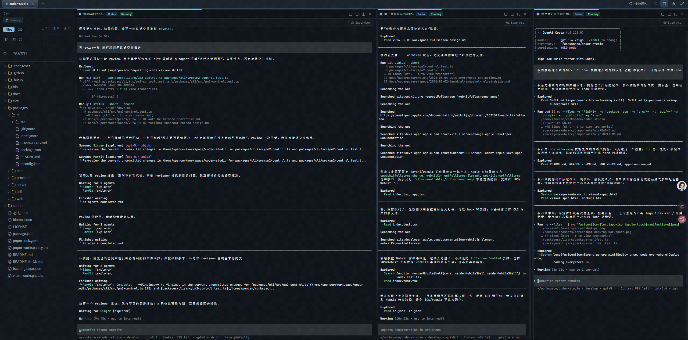

<div align="center">


# Coder Studio

</div>

<div align="center">

**AI Coding Workspace · Browser-Based · Cross-Device · Self-Hosted**

[](https://www.npmjs.com/package/@spencer-kit/coder-studio)
[](https://opensource.org/licenses/MIT)
[](https://nodejs.org/)
[](https://github.com/spencerkit/coder-studio/stargazers)
[](https://github.com/spencerkit/coder-studio/discussions)
[](https://github.com/spencerkit/coder-studio/issues)
[](https://github.com/spencerkit/coder-studio/graphs/contributors)

</div>

---

> Deploy once, code everywhere.
>
> Deploy your coding workspace once, then keep working anywhere.

[中文说明](README.zh-CN.md) | [Documentation](docs/help/quick-start.md) | [GitHub](https://github.com/spencerkit/coder-studio)

**Coder Studio** is a browser-based AI coding workspace that runs on your local machine. Access your development environment from any device with a web browser — continue coding on your phone during commute, review changes on a tablet, or switch between computers seamlessly.

## ✨ Key Features

- 🌐 **Browser-Based Workspace** — No desktop app needed, works in any modern browser
- 📱 **Cross-Device Continuity** — Start on desktop, continue on mobile, switch devices freely
- 🤖 **Multi-Agent Support** — Run Claude Code and OpenAI Codex sessions side by side
- 🔧 **Integrated Environment** — Terminal, file editor, Git viewer, and AI agents in one interface
- 🔒 **Self-Hosted & Private** — Code stays on your machine, no cloud IDE dependency
- ⚡ **Real-Time Sync** — Live workspace state across all connected devices



---

## 🎯 Why Coder Studio

| Feature | Benefit |
|---------|---------|
| **Deploy once, continue anywhere** | Start the service once, move between devices without breaking flow |
| **Unified workspace** | Agent, code, Git, and terminal in one place — no more app switching |
| **Multi-Agent support** | Run Claude Code and Codex sessions side by side |
| **Local-first & private** | Runs on your machine, code never leaves your device |
| **Zero-config browser access** | No desktop client, just open a URL from any device |

---

## 🚀 Quick Start

```bash
# Install globally
npm install -g @spencer-kit/coder-studio

# Launch the workspace
coder-studio open
```

Your browser opens automatically. Select your project folder and start working with Claude Code or OpenAI Codex.

> **No AI CLI installed yet?** You can still browse files and use the terminal. Install Claude Code or Codex later when needed.

---

## 💡 Use Cases

### Remote-Friendly Development

- Start an Agent task at the office, check progress on your phone during commute
- Review code changes on a tablet without opening your laptop
- Continue work from a home computer with zero setup

### Team Collaboration

- Share workspace URL with teammates on the same network
- Code review without screen sharing — just open the link
- Real-time visibility into Agent progress for stakeholders

### AI-Assisted Coding

- Run multiple Claude Code or Codex sessions in parallel
- Monitor Agent progress from mobile while away from desk
- Keep terminal, editor, and Git view in one unified interface

---

## 📱 Cross-Device Experience

| Device | Best For |
|--------|----------|
| 🖥️ **Desktop** | Full coding sessions, file editing, diff review, panel management |
| 📱 **Tablet** | Code review, Agent progress tracking, file browsing |
| 📲 **Phone** | Quick status checks, terminal output monitoring, session viewing |

The same workspace URL works across all devices — interface adapts automatically.

**Desktop Interface**


**Mobile Interface**


---

## 🛠️ Feature Overview

| Feature | Description |
|---------|-------------|
| **Multi-Agent Sessions** | Run Claude Code and Codex sessions side by side |
| **Integrated Editor** | Monaco-powered code editor with syntax highlighting |
| **Git Integration** | View branches, diffs, and changed files without leaving workspace |
| **Shell Terminal** | Full PTY terminal for commands and validating Agent output |
| **Responsive UI** | Desktop, tablet, and phone layouts that adapt automatically |
| **Session History** | Resume previous sessions with full context preserved |
| **Dark/Light Theme** | Customizable appearance and keyboard shortcuts |

---

## 📋 Requirements

| Dependency | Version | Notes |
|------------|---------|-------|
| Node.js | ≥ 24.0.0 | Required for running Coder Studio |
| Claude Code CLI | Latest | Optional — for Claude Agent sessions |
| OpenAI Codex CLI | Latest | Optional — for Codex Agent sessions |

---

## 📚 Documentation

| Resource | Description |
|----------|-------------|
| [Quick Start Guide](docs/help/quick-start.md) | Installation to first workspace |
| [App Overview](docs/help/app-overview.md) | Core concepts and features |
| [Provider Setup](docs/help/providers.md) | Claude Code / Codex CLI installation |
| [Desktop Guide](docs/help/desktop-guide.md) | PC interface and shortcuts |
| [Mobile Guide](docs/help/mobile-guide.md) | Phone / tablet usage |
| [Common Workflows](docs/help/workflows.md) | Task-based tutorials |
| [Troubleshooting](docs/help/troubleshooting.md) | FAQ and known issues |
| [CLI Reference](docs/help/cli.md) | Command-line options |

---

## 👥 Who Should Use Coder Studio

- **AI Coding Power Users** — Daily Claude Code / Codex users who want better session management
- **Multi-Device Developers** — Switch between office, home, and mobile devices frequently
- **Remote-First Teams** — Need to share work progress without screen sharing
- **Privacy-Conscious Developers** — Want code to stay on local machine, not cloud IDE

---

## 🔮 Roadmap

- [ ] Web-based terminal streaming optimization
- [ ] Session replay and history navigation
- [ ] Multi-workspace management
- [ ] Plugin system for custom integrations
- [ ] Cloud sync for workspace preferences

---

## 🤝 Contributing

We welcome contributions! See [Contributing Guide](CONTRIBUTING.md) for details.

### Local Development

```bash
git clone https://github.com/spencerkit/coder-studio.git
pnpm install
pnpm dev
```

### Tech Stack

| Layer | Technology |
|-------|------------|
| Frontend | React, Vite, Jotai |
| Backend | Fastify, WebSocket |
| Terminal | xterm.js, node-pty |
| Editor | Monaco Editor |
| Storage | SQLite (node:sqlite) |

### Development Docs

- [PRD](docs/PRD.zh-CN.md)
- [Design Spec](docs/superpowers/specs/2026-04-13-coder-studio-design.md)
- [More Docs](docs/)

---

## 📄 License

MIT License — see [LICENSE](LICENSE) for details.

---

## 🔍 Keywords

`ai coding assistant` `browser ide` `claude code` `codex` `remote development` `web-based ide` `self-hosted ide` `cross-device coding` `ai agent workspace` `local-first development` `mobile coding` `tablet coding` `developer tools` `terminal in browser` `git web interface` `monaco editor` `websocket terminal` `ai pair programming` `coding anywhere` `cloud ide alternative`
