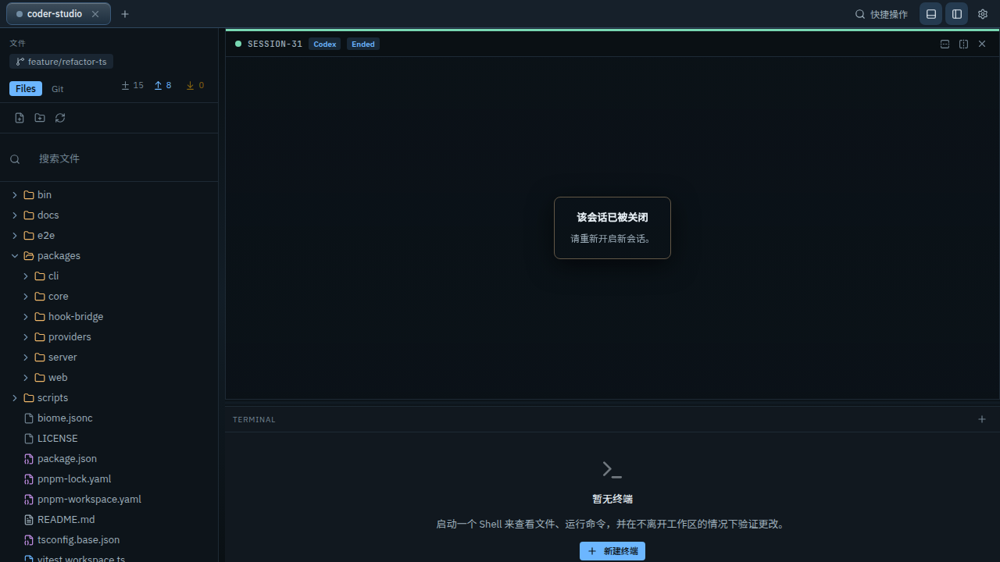

# Coder Studio

> Agent-First Development Environment

本地优先的 AI 编码工作台，将 AI Agent、代码编辑器、Git 和终端整合到统一界面中。

## 特性

- 🤖 **多Agent支持**: Claude、Codex 并行运行
- 📝 **代码编辑**: Monaco Editor + 文件树
- 🔀 **Git集成**: 状态、差异、提交
- 💻 **终端**: xterm.js + PTY
- 🎨 **主题**: 浅色/深色主题切换
- ⌨️ **快捷键**: 自定义快捷键配置
- 🌐 **国际化**: 中文/英文支持

## 快速开始

### 1. 确认 Node.js

```bash
node --version  # 需要 >= 24.0.0
```

### 2. 安装

```bash
npm install -g @spencer-kit/coder-studio
```

### 3. 打开 Coder Studio

```bash
coder-studio open
```

这会自动启动服务（如果未运行）并在浏览器中打开界面。

### 4. 打开工作区并创建第一个会话



在浏览器中选择你的项目目录，然后点击"创建会话"选择 Claude 或 Codex 即可开始。

更多细节请参考[快速开始指南](docs/help/quick-start.md)。

## 你可以用它做什么

- 打开本地项目作为工作区
- 启动 Claude 或 Codex Agent 会话
- 查看和编辑代码文件
- 浏览 Git 状态和变更
- 在工作区内使用终端
- 通过手机浏览器访问

## 文档入口

### 帮助文档
- [快速开始](docs/help/quick-start.md) — 第一次使用指南
- [App 功能总览](docs/help/app-overview.md) — 核心概念与能力
- [桌面端使用指南](docs/help/desktop-guide.md) — PC 端界面与操作
- [移动端使用指南](docs/help/mobile-guide.md) — 手机端操作指南
- [Provider 配置](docs/help/providers.md) — Claude / Codex 安装与配置
- [常见工作流](docs/help/workflows.md) — 任务式操作指南
- [排障指南](docs/help/troubleshooting.md) — 常见问题与排查
- [CLI 参考](docs/help/cli.md) — 命令行命令速查

## 开发

> **仅限贡献者**：以下命令用于本地开发和贡献代码，普通用户无需执行。
> 普通用户请直接参考上方的"快速开始"。

```bash
# 克隆仓库
git clone https://github.com/spencerkit/coder-studio.git

# 安装依赖
pnpm install

# 启动开发环境
pnpm dev

# 运行测试
pnpm acceptance:phase1

# 构建CLI
pnpm build:cli
```

### 代码质量

```bash
# 检查 lint 诊断
pnpm lint

# 自动修复安全的 lint 问题
pnpm lint:fix

# 统一格式化代码
pnpm format

# 运行聚合检查（格式、lint、imports）
pnpm check
```

## 架构

> **贡献者参考**：以下技术栈信息面向代码贡献者，普通用户无需了解。

- **Frontend**: React + Vite + Jotai
- **Backend**: Fastify + WebSocket
- **Terminal**: xterm.js + node-pty
- **Editor**: Monaco Editor
- **Storage**: SQLite (`node:sqlite`)

## 开发文档

- [PRD](docs/PRD.zh-CN.md)
- [Design Spec](docs/superpowers/specs/2026-04-13-coder-studio-design.md)
- [更多开发文档](docs/)

## 许可证

MIT
