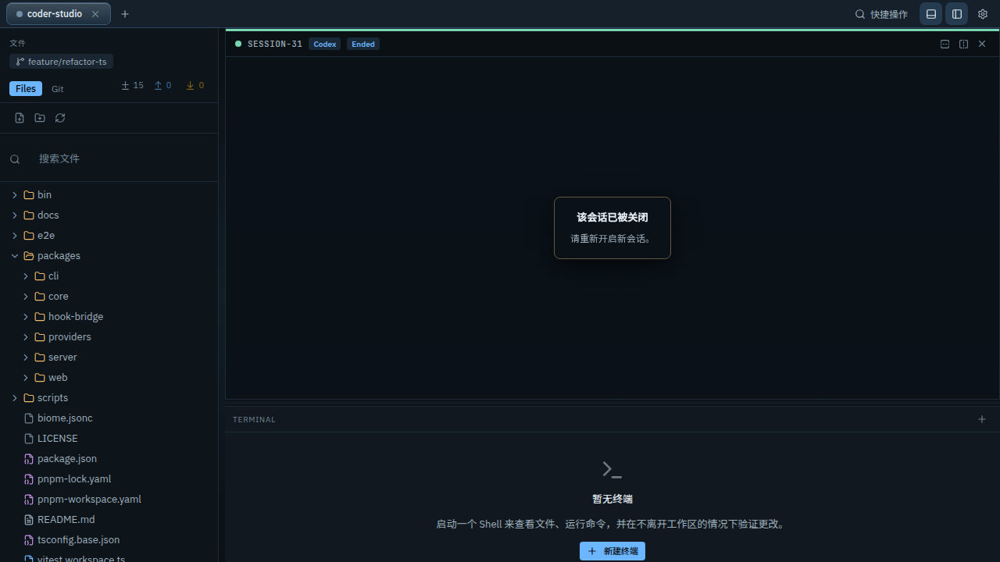
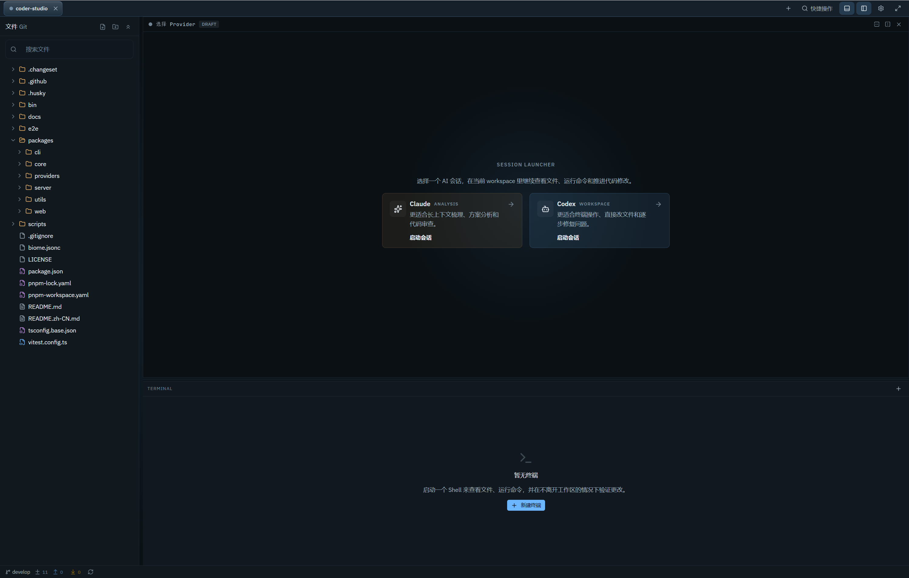

<div align="center">


# Coder Studio

**一个浏览器里的 AI 编程工作台，适合在桌面、平板和手机之间切换的开发者。**

在同一个工作台里运行 Claude Code 和 Codex，让终端、文件、Git 视图和 AI 会话跟着你在不同设备间延续。

[](https://www.npmjs.com/package/@spencer-kit/coder-studio)
[](https://opensource.org/licenses/MIT)
[](https://nodejs.org/)
[](https://github.com/spencerkit/coder-studio/stargazers)

[查看工作区](docs/help/assets/screenshot-desktop-workspace-full.png) · [快速开始](#快速开始) · [GitHub Star](https://github.com/spencerkit/coder-studio)

[English](README.md) | [文档](docs/help/quick-start.md)

</div>

[](docs/help/assets/screenshot-desktop-workspace-full.png)

<div align="center">预览这个为 AI 编程、Supervisor 监督和跨设备切换而设计的完整工作区布局。</div>

## 为什么它不一样

- **一个浏览器里完成 AI 编程工作流** — 把终端、文件、Git 和 AI 会话放到同一个工作台。
- **真正为设备切换而设计** — 在桌面端开始，在平板继续，用手机随时查看 Agent 进度。
- **目标驱动的多轮调度** — 让 Supervisor 接管长任务推进，你不必全程盯守每一轮输出，减少机械重复的人工催促，并获得更稳定的执行效果。

## 快速开始

```bash
# 全局安装
npm install -g @spencer-kit/coder-studio

# 启动工作台
coder-studio open
```

浏览器会自动打开。选择你的项目文件夹，开始使用 Claude Code 或 OpenAI Codex。

> **还没安装 AI CLI？** 你仍然可以浏览文件和使用终端。之后随时安装 Claude Code 或 Codex。

---

## 💡 使用场景

### 跨设备开发

- 在办公室启动 Agent 任务，通勤路上用手机查看进度
- 在平板上审阅代码改动，无需打开笔记本电脑
- 在家用电脑继续工作，零配置切换

### 长任务监督与调度

- 让 Supervisor 围绕目标持续推进多轮任务，不必一直盯着终端
- 用手机查看评估循环和后续动作，而不是守着每轮输出
- 减少机械重复的人工催促，让长任务执行更稳

### AI 辅助编程

- 并行运行 Claude Code 和 Codex 会话
- 终端、编辑器、Git 和 Supervisor 状态统一在一个界面
- 切换设备后继续当前 AI 工作，不必重新建立上下文

---

## 📱 跨设备体验

| 设备 | 适用场景 |
|------|----------|
| 🖥️ **桌面端** | 完整编码会话、文件编辑、diff 审阅、面板管理 |
| 📱 **平板端** | 代码审阅、Agent 进度追踪、文件浏览 |
| 📲 **手机端** | 快速状态检查、终端输出监控、会话查看 |

同一个工作区 URL 在所有设备上通用 —— 界面自动适配。

**桌面端界面**



**移动端界面**


---

## 🛠️ 功能概览

| 功能 | 描述 |
|------|------|
| **跨设备工作区** | 在桌面、平板和手机之间重新打开同一个编码环境，不必重新建立上下文 |
| **Supervisor 监督循环** | 围绕目标运行评估与续推循环，减少长任务中的人工盯守 |
| **Claude Code + Codex** | 在同一个工作区里使用两套 Agent CLI，而不是把工作流拆散到多个工具中 |
| **终端、编辑器和 Git 一体化** | 在同一个浏览器界面里完成 PTY 终端、Monaco 编辑、diff 和变更查看 |
| **响应式工作区界面** | 提供面向桌面、平板和手机的布局，而不是把桌面界面硬塞进小屏幕 |
| **会话连续性** | 切换设备后继续当前活跃会话，让 AI 工作保持可见 |
| **本地优先运行时** | 代码和运行时都留在你的机器上，不依赖云 IDE |

---

## 📋 系统要求

| 依赖 | 版本 | 说明 |
|------|------|------|
| Node.js | ≥ 24.0.0 | 运行 Coder Studio 必需 |
| Claude Code CLI | 最新版 | 可选 —— 用于 Claude Agent 会话 |
| OpenAI Codex CLI | 最新版 | 可选 —— 用于 Codex Agent 会话 |

---

## 📚 文档

| 资源 | 描述 |
|------|------|
| [快速开始](docs/help/quick-start.md) | 从安装到第一个工作区 |
| [功能总览](docs/help/app-overview.md) | 核心概念和功能 |
| [Provider 配置](docs/help/providers.md) | Claude Code / Codex CLI 安装 |
| [桌面端指南](docs/help/desktop-guide.md) | PC 界面和快捷键 |
| [移动端与远程访问指南](docs/help/mobile-guide.md) | 手机/平板使用、局域网访问、Tailscale/ngrok/Cloudflare Tunnel |
| [常用工作流](docs/help/workflows.md) | 任务式教程 |
| [故障排除](docs/help/troubleshooting.md) | 常见问题和修复 |
| [CLI 参考](docs/help/cli.md) | 命令行选项 |

---

## 👥 谁适合使用

- **AI 编程深度用户** — 每天使用 Claude Code / Codex，想要更好的会话管理
- **多设备开发者** — 频繁在办公室、家和移动设备之间切换
- **运行长任务的开发者** — 希望由 Supervisor 持续推进多轮任务，而不是全程人工盯守
- **注重隐私的开发者** — 希望代码留在本地机器，不依赖云 IDE

---

## 🔮 路线图

- [ ] Web 终端流式优化
- [ ] 会话回放和历史导航
- [ ] 多工作区管理
- [ ] 插件系统支持自定义集成
- [ ] 工作区偏好云同步

---

## 🤝 贡献

欢迎贡献！查看 [贡献指南](CONTRIBUTING.md) 了解详情。

### 本地开发

```bash
git clone https://github.com/spencerkit/coder-studio.git
pnpm install
pnpm dev
```

### 技术栈

| 层级 | 技术 |
|------|------|
| 前端 | React, Vite, Jotai |
| 后端 | Fastify, WebSocket |
| 终端 | xterm.js, node-pty |
| 编辑器 | Monaco Editor |
| 存储 | SQLite (node:sqlite) |

### 开发文档

- [PRD](docs/PRD.zh-CN.md)
- [设计规范](docs/superpowers/specs/2026-04-13-coder-studio-design.md)
- [更多文档](docs/)

---

## 📄 许可证

MIT 许可证 —— 查看 [LICENSE](LICENSE) 了解详情。

---

## 🔍 关键词

`AI 编程助手` `浏览器 IDE` `Claude Code` `Codex` `远程开发` `网页 IDE` `自托管 IDE` `跨设备编程` `AI Agent 工作区` `本地优先开发` `移动端编程` `平板编程` `开发者工具` `浏览器终端` `Git 网页界面` `Monaco 编辑器` `WebSocket 终端` `AI 结对编程` `随处编程` `云 IDE 替代`
