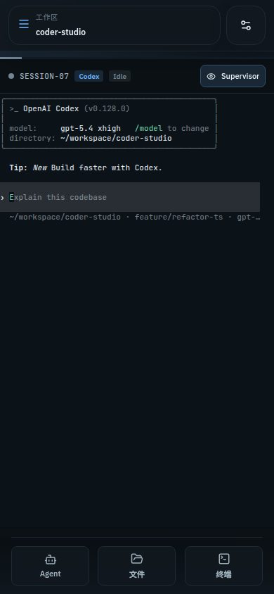

# 移动端使用指南

这篇文档介绍如何通过手机浏览器使用 Coder Studio。移动端适合查看状态、监控 Agent 进度和轻量操作。

## 这篇文档解决什么问题

如何在手机上访问和使用 Coder Studio，包括界面导航、会话管理和文件查看。

## 前置条件

- Coder Studio 服务已在电脑上运行（`coder-studio serve` 或 `coder-studio open`）
- 手机和电脑在同一局域网
- 手机浏览器访问 `http://<电脑IP>:<端口>`

> 如果不知道本机 IP 和端口，执行 `coder-studio status` 查看 "Listen URL"。

## 移动端界面结构

### 顶部栏

- 工作区名称（点击打开工作区抽屉，可切换工作区）
- 设置入口

### 当前 Agent 区域

显示当前活跃会话的状态和输出。没有会话时会显示提示信息。

### 底部 Dock

底部有三个入口：

- **Agent**：打开 Agent 面板，管理会话
- **Files**：打开文件面板
- **Terminal**：打开终端面板

## 操作步骤

### 切换或打开工作区

点击顶部栏的工作区名称，打开工作区抽屉。在抽屉中可以：

- 切换到其他已打开的工作区
- 点击按钮打开新的工作区

### 创建第一个 Agent 会话

点击底部 Dock 的 **Agent** 按钮，打开 Agent 面板。如果没有活跃会话，面板默认处于创建模式。点击创建会话并选择 Provider。

### 切换当前会话

在 Agent 面板中可以看到所有会话列表。点击任意会话即可将其设为当前活跃会话。

### 查看文件

点击底部 Dock 的 Files 按钮，打开文件面板。文件面板包含：

- 文件树浏览
- 点击文件可查看内容
- Git 视图（查看分支和变更列表）

### 查看终端

点击底部 Dock 的 Terminal 按钮，打开终端面板。包含：

- 该工作区的所有终端
- 新建终端的入口

### Supervisor 与通知

如果 Supervisor 处于活跃状态，Agent 区域会显示 Supervisor 徽章。点击可以打开 Supervisor 详情面板，查看当前进度。

## 使用建议

- 移动端适合"查看"为主，复杂的文件编辑和 Agent 管理建议在桌面端完成
- 手机键盘弹出时会压缩底部 Dock 区域，操作时注意布局变化
- 终端操作在小屏幕上可能不便，建议仅在需要时查看

## 常见问题

**Q：文件面板打不开怎么办？**
检查顶栏连接状态是否正常，可能需要刷新页面。

**Q：Agent 面板没有响应？**
确保 Provider 已正确安装且服务在运行。

**Q：手机上怎么知道访问地址？**
在电脑上执行 `coder-studio status`，找到 "Local URL" 对应的地址。确保手机和电脑在同一网络。

## 下一步

- [桌面端使用指南](desktop-guide.md) — 熟悉桌面端完整功能
- [常见工作流](workflows.md) — 任务式操作指南
