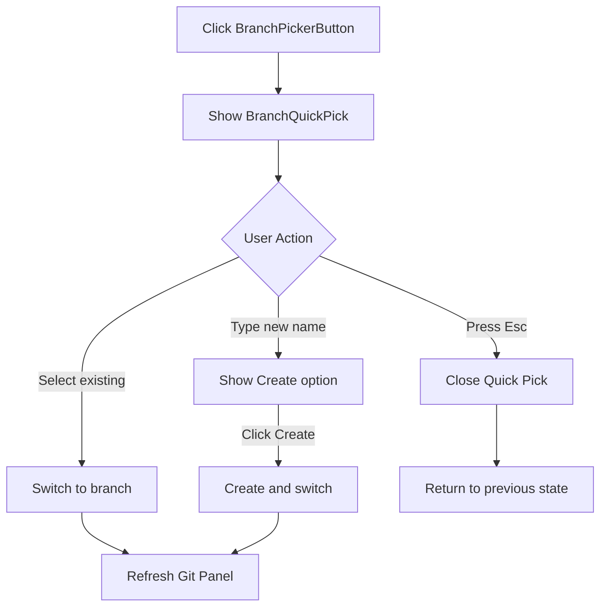

# Git Branch Switcher Design

## Overview

Add a VS Code-style Quick Pick branch switching feature to the Git Panel toolbar, enabling users to quickly browse, filter, select, and create git branches.

## Goals

### Primary Goals

1. **Fast Branch Switching** - One-click access to branch switcher, minimal friction
2. **Branch Creation** - Support creating new branches directly from the switcher
3. **Remote Branch Support** - Show both local and remote branches, auto-create tracking branches
4. **Keyboard-First UX** - Full keyboard navigation and filtering support

### Non-Goals

1. Branch deletion (out of scope for this feature)
2. Branch renaming (out of scope)
3. Merge/rebase operations (different workflow)
4. Detached HEAD checkout (not needed per user requirement)

## Success Criteria

1. **Performance** - Branch list loads in < 500ms
2. **Usability** - Users can switch branches in < 2 clicks/keystrokes
3. **Discoverability** - Branch button visible in Git Panel toolbar
4. **Integration** - Seamless with existing Git workflow (stage/commit/discard)

---

## Architecture

### UI Architecture

**Location:** Git Panel toolbar (leftmost position)

**Component Hierarchy:**
```
GitPanel
  ├── GitToolbar
  │   ├── BranchPickerButton ← NEW (shows current branch + GitBranch icon)
  │   ├── RefreshBtn
  │   ├── StageAllBtn
  │   ├── UnstageAllBtn
  │   ├── DiscardAllBtn
  │   └── CommitBtn
  ├── BranchQuickPick ← NEW (overlay component)
  │   ├── SearchInput
  │   ├── BranchList
  │   │   ├── LocalBranchItem
  │   │   ├── RemoteBranchItem
  │   │   └── CreateBranchOption
  │   └── KeyboardNav
  ├── CommitInput
  └── ChangeList
```

### Interaction Flow



---

## State Management

### Jotai Atoms

**File:** `packages/web/src/atoms/git.ts`

**New Types:**
```typescript
export interface GitBranch {
  name: string;        // Branch name (e.g., "main", "origin/feature")
  isRemote: boolean;   // Whether it's a remote branch
  isCurrent: boolean;  // Whether it's the current branch
  remote?: string;     // Remote name (e.g., "origin")
}

export interface GitBranchList {
  current: string;           // Current branch name
  branches: GitBranch[];      // All branches (local + remote)
  loading: boolean;
  error?: string;
}

export interface BranchQuickPickState {
  visible: boolean;          // Whether Quick Pick is shown
  workspaceId?: string;      // Associated workspace
  inputValue: string;        // Search input value
  selectedBranch?: string;   // Keyboard-selected branch
}
```

**New Atoms:**
```typescript
// Branch list per workspace
export const gitBranchListAtomFamily = atomFamily(
  (workspaceId: string) => atom<GitBranchList>({
    current: '',
    branches: [],
    loading: false,
  })
);

// Quick Pick UI state (global)
export const branchQuickPickAtom = atom<BranchQuickPickState>({
  visible: false,
  inputValue: '',
});
```

### Data Loading Strategy

**Load Triggers:**
1. Git Panel initialization (initial load)
2. Branch switch success (refresh list)
3. `fs.dirty` event (external git operations)
4. Manual refresh via toolbar button

**State Updates:**
- Atom updates trigger React re-renders
- Branch list cached per workspace (avoid redundant fetches)
- Quick Pick state isolated (no workspace coupling)

---

## Component Design

### BranchPickerButton

**File:** `packages/web/src/features/workspace/components/branch-picker-button.tsx`

**Props:**
```typescript
interface BranchPickerButtonProps {
  workspaceId: string;
}
```

**Core Logic:**
```typescript
const BranchPickerButton: FC<BranchPickerButtonProps> = ({ workspaceId }) => {
  const branchList = useAtomValue(gitBranchListAtomFamily(workspaceId));
  const setQuickPick = useSetAtom(branchQuickPickAtom);

  const handleClick = () => {
    setQuickPick({
      visible: true,
      workspaceId,
      inputValue: '',
    });
  };

  return (
    <button
      className="panel-toolbar-btn branch-picker-btn"
      onClick={handleClick}
      title="Switch Branch"
    >
      <GitBranch size={14} />
      <span className="branch-name">
        {branchList.current || 'No branch'}
      </span>
    </button>
  );
};
```

**Responsibilities:**
- Display current branch name (truncated if too long)
- Show GitBranch icon from lucide-react
- Trigger Quick Pick visibility on click

---

### BranchQuickPick

**File:** `packages/web/src/features/workspace/components/branch-quick-pick.tsx`

**Props:**
```typescript
interface BranchQuickPickProps {}
// Uses global branchQuickPickAtom
```

**State Variables:**
```typescript
const quickPickState = useAtomValue(branchQuickPickAtom);
const [selectedIndex, setSelectedIndex] = useState(0);
const [inputValue, setInputValue] = useState('');

// Derived state
const filteredBranches = useMemo(() => {
  return branchList.branches.filter(b =>
    b.name.toLowerCase().includes(inputValue.toLowerCase())
  );
}, [branchList.branches, inputValue]);

const showCreateOption = useMemo(() => {
  const exactMatch = branchList.branches.some(b =>
    b.name === inputValue
  );
  return inputValue.trim() && !exactMatch;
}, [branchList.branches, inputValue]);
```

**Keyboard Handlers:**
```typescript
const handleKeyDown = (e: KeyboardEvent) => {
  switch (e.key) {
    case 'ArrowDown':
      setSelectedIndex(i => Math.min(i + 1, filteredBranches.length - 1));
      break;
    case 'ArrowUp':
      setSelectedIndex(i => Math.max(i - 1, 0));
      break;
    case 'Enter':
      if (showCreateOption && selectedIndex === filteredBranches.length) {
        handleCreateBranch(inputValue);
      } else {
        handleSelectBranch(filteredBranches[selectedIndex]);
      }
      break;
    case 'Escape':
      handleClose();
      break;
  }
};
```

**Branch Operations:**
```typescript
const handleSelectBranch = async (branch: GitBranch) => {
  await dispatch('git.checkout', {
    workspaceId,
    ref: branch.name,
  });

  await loadBranchList();
  await loadGitStatus();
  handleClose();
};

const handleCreateBranch = async (name: string) => {
  await dispatch('git.checkout', {
    workspaceId,
    ref: name,
    createBranch: true,
  });

  await loadBranchList();
  await loadGitStatus();
  handleClose();
};
```

**Rendering Structure:**
```tsx
<div className="branch-quick-pick-overlay" onClick={handleClose}>
  <div className="branch-quick-pick" onClick={e => e.stopPropagation()}>
    <input
      className="branch-search-input"
      placeholder="Search or create branch..."
      value={inputValue}
      onChange={e => setInputValue(e.target.value)}
      onKeyDown={handleKeyDown}
      autoFocus
    />

    <div className="branch-list">
      {filteredBranches.map((branch, index) => (
        <div
          key={branch.name}
          className={`branch-item ${index === selectedIndex ? 'selected' : ''}`}
          onClick={() => handleSelectBranch(branch)}
        >
          {branch.isCurrent && <Check size={12} className="branch-item-check" />}
          <span className="branch-name">{branch.name}</span>
          {branch.isRemote && (
            <span className="branch-badge">Remote</span>
          )}
        </div>
      ))}

      {showCreateOption && (
        <div
          className={`branch-item create-option ${
            selectedIndex === filteredBranches.length ? 'selected' : ''
          }`}
          onClick={() => handleCreateBranch(inputValue)}
        >
          <Plus size={12} />
          <span>Create branch: {inputValue}</span>
        </div>
      )}
    </div>
  </div>
</div>
```

---

## Backend API

### Existing Commands

**Project already has required git commands:**

1. **`git.branches`** - List branches (needs enhancement)
2. **`git.checkout`** - Switch branches (needs enhancement)
3. **`git.branch`** - Create branches (already supports startPoint)

### Required Changes

#### 1. Enhance `runGitListBranches`

**File:** `packages/server/src/git/cli.ts`

**Current Implementation:**
```typescript
export async function runGitListBranches(cwd: string): Promise<{
  branches: string[];
  current: string;
}>
```

**Enhanced Implementation:**
```typescript
export interface GitBranch {
  name: string;
  isRemote: boolean;
  isCurrent: boolean;
  remote?: string;
}

export async function runGitListBranches(cwd: string): Promise<{
  branches: GitBranch[];
  current: string;
}> {
  // Get local branches
  const { stdout: localOutput } = await runGit(cwd, ['branch', '--list']);

  // Get remote branches
  const { stdout: remoteOutput } = await runGit(cwd, ['branch', '-r']);

  const branches: GitBranch[] = [];
  let current = '';

  // Parse local branches
  const localLines = localOutput.split('\n').filter(line => line.trim());
  for (const line of localLines) {
    const isCurrent = line.startsWith('*');
    const name = line.replace(/^\*?\s+/, '').trim();
    branches.push({
      name,
      isRemote: false,
      isCurrent,
    });
    if (isCurrent) current = name;
  }

  // Parse remote branches
  const remoteLines = remoteOutput.split('\n').filter(line => line.trim());
  for (const line of remoteLines) {
    const fullName = line.trim();
    const [remote, branchName] = fullName.split('/');
    branches.push({
      name: fullName,  // Show full name "origin/main"
      isRemote: true,
      isCurrent: false,
      remote,
    });
  }

  return { branches, current };
}
```

#### 2. Enhance `runGitCheckout`

**File:** `packages/server/src/git/cli.ts`

**Current Implementation:**
```typescript
export async function runGitCheckout(
  cwd: string,
  ref: string,
  options?: { createBranch?: boolean }
): Promise<{ success: boolean; message: string; branch?: string }>
```

**Enhanced Implementation:**
```typescript
export async function runGitCheckout(
  cwd: string,
  ref: string,
  options?: { createBranch?: boolean }
): Promise<{ success: boolean; message: string; branch?: string }> {
  const args = ['checkout'];

  // If ref is remote branch (contains '/'), auto-create tracking branch
  if (ref.includes('/') && !options?.createBranch) {
    const branchName = ref.split('/').pop() ?? ref;
    args.push('-b', branchName, ref);
  } else {
    if (options?.createBranch) {
      args.push('-b');
    }
    args.push(ref);
  }

  const { stdout, stderr } = await runGit(cwd, args);

  // Extract branch name from output
  const branchMatch = stdout.match(/Switched to (?:a new branch|branch) '([^']+)'/);
  const branch = branchMatch?.[1] ?? ref;

  return { success: true, message: stdout || stderr, branch };
}
```

**Logic:**
- Remote branch (e.g., "origin/main") → Create local "main" tracking "origin/main"
- Local branch → Regular checkout
- `createBranch: true` → Create new branch from HEAD

### Frontend Integration

**Load Branch List:**
```typescript
const result = await dispatch<{ branches: GitBranch[], current: string }>(
  'git.branches',
  { workspaceId }
);
```

**Switch Local Branch:**
```typescript
await dispatch('git.checkout', {
  workspaceId,
  ref: 'main'
});
```

**Switch Remote Branch (Auto-create tracking):**
```typescript
await dispatch('git.checkout', {
  workspaceId,
  ref: 'origin/feature-x'
});
// Creates local "feature-x" tracking "origin/feature-x"
```

**Create New Branch:**
```typescript
await dispatch('git.checkout', {
  workspaceId,
  ref: 'new-feature',
  createBranch: true
});
```

---

## Styling

### CSS Styles

**File:** `packages/web/src/styles/components.css`

**Design Language:** Reuse Command Palette styles for consistency.

```css
/* ========== Branch Quick Pick ========== */

.branch-quick-pick-overlay {
  position: fixed;
  inset: 0;
  background: rgba(0, 0, 0, 0.6);
  display: flex;
  align-items: flex-start;
  justify-content: center;
  padding-top: var(--sp-16);
  z-index: var(--z-modal-backdrop);
  animation: fadeIn var(--duration-fast) var(--ease-out);
}

.branch-quick-pick {
  width: 100%;
  max-width: 440px;
  background: var(--bg-surface);
  border: 1px solid var(--border);
  border-radius: var(--radius-xl);
  box-shadow: var(--shadow-xl);
  overflow: hidden;
  animation: slideInUp var(--duration-normal) var(--ease-out);
}

.branch-search-input {
  display: flex;
  align-items: center;
  gap: var(--sp-3);
  padding: var(--sp-3) var(--sp-4);
  border-bottom: 1px solid var(--border);
  background: transparent;
  border: none;
  font-size: var(--text-base);
  color: var(--text-primary);
  outline: none;
  width: 100%;
}

.branch-search-input::placeholder {
  color: var(--text-tertiary);
}

.branch-list {
  max-height: 280px;
  overflow-y: auto;
}

.branch-item {
  display: flex;
  align-items: center;
  gap: var(--sp-2);
  padding: var(--sp-2) var(--sp-4);
  cursor: pointer;
  transition: background var(--duration-fast) var(--ease-out);
}

.branch-item:hover,
.branch-item.selected {
  background: var(--bg-surface-hover);
}

.branch-item-check {
  flex-shrink: 0;
  color: var(--text-primary);
}

.branch-name {
  flex: 1;
  font-size: var(--text-sm);
  color: var(--text-primary);
}

.branch-badge {
  flex-shrink: 0;
  font-size: var(--text-xs);
  color: var(--text-tertiary);
  background: var(--bg-surface-elevated);
  padding: var(--sp-1) var(--sp-2);
  border-radius: var(--radius-sm);
}

.branch-item.create-option {
  border-top: 1px solid var(--border);
  color: var(--text-accent);
}

.branch-item.create-option:hover {
  background: var(--bg-accent-subtle);
}

/* Toolbar Button */
.branch-picker-btn {
  display: flex;
  align-items: center;
  gap: var(--sp-2);
  padding: var(--sp-1) var(--sp-2);
}

.branch-picker-btn .branch-name {
  font-size: var(--text-xs);
  max-width: 120px;
  overflow: hidden;
  text-overflow: ellipsis;
}
```

### Interaction Details

**1. Positioning**
- Screen top center (padding-top: var(--sp-16))
- Same as Command Palette

**2. Animations**
- `fadeIn` - Overlay backdrop (200ms)
- `slideInUp` - Quick Pick panel (300ms)
- Hover/selected transitions (150ms)

**3. Scrolling**
- Max height 280px, scroll when exceeded
- Inherits project scrollbar styles

**4. Keyboard Focus**
- Auto-focus input on open
- Real-time filtering
- `↑↓` navigation
- `Enter` confirm, `Esc` close

**5. Branch Item Display**
- **Local:** Just name
- **Current:** Checkmark ✓ + name
- **Remote:** Name + "Remote" badge

**6. Create Option**
- Shown when input doesn't match any branch
- Blue accent color
- Separated by border

---

## Error Handling

### Error Scenarios

1. **Branch Load Failure**
   - Git command error (e.g., not a git repo)
   - Network error (remote branch fetch)

2. **Checkout Failure**
   - Uncommitted changes conflict
   - Branch doesn't exist
   - Remote branch fetch timeout

3. **Create Branch Failure**
   - Invalid branch name (special chars)
   - Branch already exists

### Error Handling Strategy

**Frontend:**
```typescript
const loadBranchList = async () => {
  try {
    const result = await dispatch('git.branches', { workspaceId });
    if (!result.ok) {
      setError(result.error?.message || 'Failed to load branches');
      return;
    }
    setBranchList(result.data);
  } catch (e) {
    setError('Unexpected error loading branches');
  }
};

const handleSelectBranch = async (branch: GitBranch) => {
  try {
    const result = await dispatch('git.checkout', {
      workspaceId,
      ref: branch.name
    });

    if (!result.ok) {
      alert(result.error?.message || 'Failed to switch branch');
      return;
    }

    // Success - refresh states
    await loadBranchList();
    await loadGitStatus();
    handleClose();
  } catch (e) {
    alert('Unexpected error switching branch');
  }
};
```

**Backend:**
- All git commands already wrapped in error handling (`runGit` catches subprocess errors)
- Return structured error responses via `DispatchResult`
- Error messages propagated to frontend

**UI Feedback:**
- **Toast/Alert:** Show error message on failure
- **Loading State:** Disable interactions during operation
- **Validation:** Prevent invalid branch names (empty, special chars)

---

## Testing Strategy

### Unit Tests

**Frontend Components:**
```typescript
// BranchPickerButton.test.tsx
describe('BranchPickerButton', () => {
  it('displays current branch name', () => {...});
  it('shows "No branch" when detached HEAD', () => {...});
  it('opens Quick Pick on click', () => {...});
});

// BranchQuickPick.test.tsx
describe('BranchQuickPick', () => {
  it('filters branches by input', () => {...});
  it('shows create option for non-existent branch', () => {...});
  it('handles keyboard navigation', () => {...});
  it('calls checkout on Enter', () => {...});
  it('closes on Escape', () => {...});
});
```

**Backend Functions:**
```typescript
// git/cli.test.ts
describe('runGitListBranches', () => {
  it('returns local and remote branches', () => {...});
  it('identifies current branch', () => {...});
  it('handles empty repo', () => {...});
});

describe('runGitCheckout', () => {
  it('switches to local branch', () => {...});
  it('creates tracking branch for remote', () => {...});
  it('creates new branch with createBranch flag', () => {...});
  it('handles checkout conflicts', () => {...});
});
```

### Integration Tests

**E2E Test Flow:**
```typescript
// e2e/specs/git-branch-switching.spec.ts
describe('Git Branch Switching', () => {
  it('switches to existing local branch', () => {
    // 1. Open workspace
    // 2. Click branch button
    // 3. Select branch from list
    // 4. Verify branch switched
    // 5. Verify Git Panel updated
  });

  it('creates and switches to new branch', () => {
    // 1. Open Quick Pick
    // 2. Type new branch name
    // 3. Click create option
    // 4. Verify branch created and switched
  });

  it('switches to remote branch (creates tracking)', () => {
    // 1. Select remote branch
    // 2. Verify local tracking branch created
    // 3. Verify tracking relationship
  });
});
```

### Test Coverage Goals

- **Frontend:** 80% coverage (components, hooks, utils)
- **Backend:** 90% coverage (git operations)
- **E2E:** Critical user flows covered

---

## Implementation Checklist

### Phase 1: Backend Enhancement

1. ✅ Enhance `runGitListBranches` to return structured `GitBranch[]`
2. ✅ Enhance `runGitCheckout` to handle remote branches
3. ✅ Write unit tests for enhanced functions
4. ✅ Update TypeScript types in `@coder-studio/core`

### Phase 2: State Management

1. ✅ Add `GitBranch` and `GitBranchList` types to `atoms/git.ts`
2. ✅ Create `gitBranchListAtomFamily`
3. ✅ Create `branchQuickPickAtom`
4. ✅ Add branch loading logic in Git Panel

### Phase 3: UI Components

1. ✅ Create `BranchPickerButton` component
2. ✅ Create `BranchQuickPick` component
3. ✅ Implement keyboard navigation
4. ✅ Add branch filtering logic
5. ✅ Handle branch creation flow

### Phase 4: Styling

1. ✅ Add Quick Pick styles to `components.css`
2. ✅ Add toolbar button styles
3. ✅ Ensure responsive design
4. ✅ Test animations

### Phase 5: Integration

1. ✅ Wire components into Git Panel
2. ✅ Handle state updates on branch switch
3. ✅ Refresh Git status after switch
4. ✅ Listen to `fs.dirty` events

### Phase 6: Testing & Polish

1. ✅ Write unit tests (80% coverage)
2. ✅ Write E2E tests
3. ✅ Error handling and edge cases
4. ✅ Performance optimization
5. ✅ Documentation

---

## Future Enhancements (Out of Scope)

1. **Branch Deletion** - Add delete option in Quick Pick
2. **Branch Rename** - Inline rename feature
3. **Branch Favorites** - Pin frequently-used branches
4. **Multi-Workspace** - Cross-workspace branch switching
5. **Stash Integration** - Auto-stash before switch

---

## References

- **VS Code Quick Pick:** https://code.visualstudio.com/docs/getstarted/userinterface#_quick-pick
- **Project Git Panel:** `packages/web/src/features/workspace/components/git-panel.tsx`
- **Project Command Palette:** Styles in `packages/web/src/styles/components.css`
- **Git Commands:** `packages/server/src/commands/git.ts`